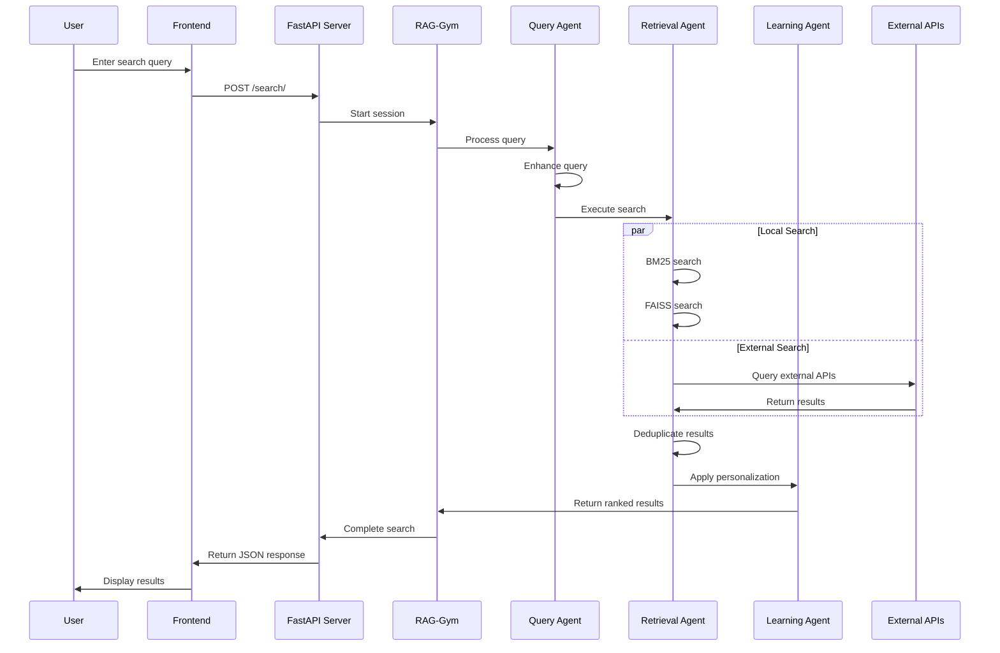
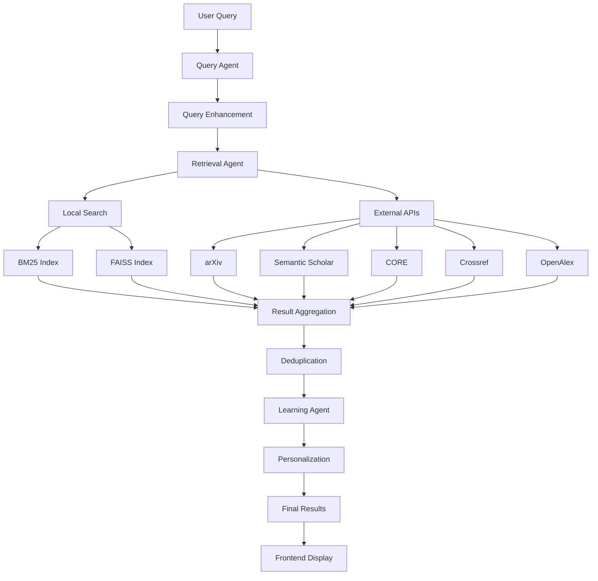

# Research Paper Retrieval System

A comprehensive multi-agent AI platform for intelligent research paper discovery, personalization, and recommendation. This system integrates multiple academic databases and uses advanced RAG (Retrieval-Augmented Generation) techniques to provide highly relevant research papers based on user queries.

## Table of Contents
1. [Features](#features)
2. [System Architecture](#system-architecture)
3. [Directory Structure](#directory-structure)
4. [Installation & Setup](#installation--setup)
5. [Running the Application](#running-the-application)
6. [API Endpoints](#api-endpoints)
7. [Frontend Interface](#frontend-interface)
8. [Technical Implementation](#technical-implementation)
9. [Testing](#testing)
10. [Extending the System](#extending-the-system)
11. [Troubleshooting](#troubleshooting)

## Features

### Core Capabilities
- **Multi-Agent Architecture**: Specialized agents for retrieval, query processing, and learning
- **RAG-Gym Integration**: Advanced retrieval-augmented generation with continuous learning
- **Hybrid Search**: Combines BM25 (keyword-based) and FAISS (semantic) search algorithms
- **Multi-Source Integration**: Fetches papers from arXiv, Semantic Scholar, CORE, Crossref, and OpenAlex
- **Real-time Personalization**: Learns from user interactions to improve future recommendations
- **Multi-hop Retrieval**: Iterative query refinement for better results

### Advanced Features
- **Session Management**: Tracks user search sessions for context-aware recommendations
- **Duplicate Detection**: Intelligent deduplication across multiple sources
- **Result Ranking**: Machine learning-based result reranking
- **Feedback Learning**: Continuous improvement through user interaction data
- **Performance Metrics**: Comprehensive search and system performance tracking

## System Architecture

```mermaid
graph TB
    subgraph "Frontend Layer"
        UI[Web Interface<br/>HTML/CSS/JS]
        STATIC[Static Files<br/>/static/css/style.css<br/>/static/js/app.js]
    end
    
    subgraph "FastAPI Backend"
        API[FastAPI Server<br/>src/main.py]
        ROUTES[API Routes<br/>GET /<br/>POST /search/<br/>GET /rag/sessions/{id}]
    end
    
    subgraph "Agent Layer"
        QA[Query Agent<br/>src/agents/query_agent.py]
        RA[Retrieval Agent<br/>src/agents/retrieval_agent.py]
        LA[Learning Agent<br/>src/agents/learning_agent.py]
        RG[RAG-Gym<br/>src/rag_gym.py]
    end
    
    subgraph "Storage Layer"
        LI[Local Index<br/>BM25 + FAISS<br/>data/paper_index*]
        LD[Learning Data<br/>User Preferences<br/>data/learning/]
        RD[RAG Data<br/>Session History<br/>data/rag_gym/]
    end
    
    subgraph "External APIs"
        AR[arXiv<br/>utils/arxiv_fetcher.py]
        SS[Semantic Scholar<br/>utils/semantic_scholar_fetcher.py]
        CO[CORE<br/>utils/core_fetcher.py]
        CR[Crossref<br/>utils/crossref_fetcher.py]
        OA[OpenAlex<br/>utils/openalex_fetcher.py]
    end
    
    UI --> API
    STATIC --> UI
    API --> ROUTES
    ROUTES --> RG
    RG --> QA
    RG --> RA
    RG --> LA
    
    QA --> RA
    RA --> LI
    RA --> AR
    RA --> SS
    RA --> CO
    RA --> CR
    RA --> OA
    
    LA --> LD
    RG --> RD
    
    LA -.->|Feedback| QA
    LA -.->|Preferences| RA
```

## Directory Structure

```
D:\minorprojo\
│
├── .env                      # Environment variables
├── requirements.txt          # Python dependencies
├── setup.py                 # Package setup
├── README.md               # This file
│
├── src/                    # Source code
│   ├── __init__.py
│   ├── main.py            # FastAPI application entry point
│   ├── rag_gym.py         # RAG-Gym orchestration
│   │
│   ├── agents/            # Intelligent agents
│   │   ├── __init__.py
│   │   ├── base_agent.py          # Base agent class
│   │   ├── query_agent.py         # Query processing & enhancement
│   │   ├── retrieval_agent.py     # Search & retrieval logic
│   │   └── learning_agent.py      # Personalization & learning
│   │
│   ├── models/            # Data models
│   │   ├── __init__.py
│   │   └── paper.py              # Paper data structure
│   │
│   └── utils/             # Utility functions
│       ├── __init__.py
│       ├── text_utils.py         # Text processing utilities
│       ├── text_embeddings.py    # Embedding generation
│       ├── arxiv_fetcher.py      # arXiv API integration
│       ├── semantic_scholar_fetcher.py  # Semantic Scholar API
│       ├── core_fetcher.py       # CORE API integration
│       ├── crossref_fetcher.py   # Crossref API integration
│       ├── openalex_fetcher.py   # OpenAlex API integration
│       ├── ieee_fetcher.py       # IEEE API integration
│       └── springer_fetcher.py   # Springer API integration
│
├── templates/             # HTML templates
│   └── index.html        # Main web interface
│
├── static/               # Static web assets
│   ├── css/
│   │   └── style.css    # Application styles
│   └── js/
│       └── app.js       # Frontend JavaScript
│
├── data/                # Data storage (created at runtime)
│   ├── paper_index*     # Local search indexes
│   ├── learning/        # User preference data
│   └── rag_gym/        # RAG session data
│
├── tests/               # Test suite
│   ├── __init__.py
│   ├── test_query_agent.py
│   └── test_retrieval_agent.py
│
└── venv/               # Virtual environment (if created)
```

## Installation & Setup

### Prerequisites
- Python 3.8 or higher
- pip package manager
- Internet connection for external API access

### 1. Clone the Repository
```bash
git clone <repository_url>
cd minorprojo
```

### 2. Create Virtual Environment
```bash
# Create virtual environment
python -m venv venv

# Activate virtual environment
# On Windows:
venv\Scripts\activate
# On macOS/Linux:
source venv/bin/activate
```

### 3. Install Dependencies
```bash
pip install -r requirements.txt
```

### 4. Environment Configuration
Create a `.env` file in the root directory:
```env
# API Keys (optional but recommended for better results)
SEMANTIC_SCHOLAR_API_KEY=your_semantic_scholar_api_key
IEEE_API_KEY=your_ieee_api_key
CORE_API_KEY=your_core_api_key
SPRINGER_API_KEY=your_springer_api_key

# Configuration
MAX_RESULTS_PER_SOURCE=10
LOG_LEVEL=INFO
PORT=8000
```

### 5. Initialize the System
The application will automatically create necessary directories and initialize indexes on first run.

## Running the Application

### Development Mode
```bash
# From the project root directory
uvicorn src.main:app --reload
```

### Production Mode
```bash
# From the project root directory
uvicorn src.main:app --host 0.0.0.0 --port 8000
```

### Direct Execution
```bash
python src/main.py
```

### Access the Application
Open your web browser and navigate to:
- **Local access**: http://127.0.0.1:8000
- **Network access**: http://0.0.0.0:8000

## API Endpoints

### Core Endpoints

#### `GET /`
**Description**: Renders the main web interface  
**Response**: HTML page with search interface

#### `POST /search/`
**Description**: Main search endpoint for paper retrieval  
**Parameters**:
- `query` (string): Search query
- `user_id` (string, optional): User identifier for personalization

**Response**:
```json
{
  "results": [
    {
      "id": "paper_id",
      "title": "Paper Title",
      "authors": ["Author 1", "Author 2"],
      "abstract": "Paper abstract...",
      "publication_year": 2023,
      "source": "arxiv",
      "url": "https://arxiv.org/abs/...",
      "doi": "10.1000/xyz"
    }
  ],
  "improved_query": "enhanced query",
  "session_id": "session_12345",
  "metrics": {
    "total_time_seconds": 2.45,
    "raw_results_count": 50,
    "final_results_count": 20
  }
}
```

#### `GET /rag/sessions/{session_id}`
**Description**: Get status of a RAG search session  
**Response**:
```json
{
  "user_id": "user_123",
  "query": "machine learning",
  "step": "ranking",
  "results_count": 15,
  "elapsed_time": 3.2
}
```

#### `POST /metrics/search`
**Description**: Record search performance metrics  
**Body**: JSON object with metrics data  
**Response**: `{"status": "success"}`

#### `POST /rag/train`
**Description**: Trigger training of RAG models  
**Response**:
```json
{
  "status": "success",
  "prm_trained": true,
  "sft_trained": true
}
```

## Frontend Interface

### Search Interface Features
- **Search Input**: Query text field with placeholder examples
- **Source Filtering**: Dropdown to filter results by academic source (arXiv, Semantic Scholar, CORE, etc.)
- **Real-time Results**: Dynamic result display with loading indicators
- **Paper Details**: Title, authors, abstract, and source information
- **External Links**: Direct links to original papers

### CSS Styling (`static/css/style.css`)
```css
.paper {
    background: white;
    border: none;
    padding: 20px;
    margin-bottom: 20px;
    border-radius: 8px;
    box-shadow: 0 2px 8px rgba(0, 0, 0, 0.1);
    transition: transform 0.2s;
}

.paper:hover {
    transform: translateY(-3px);
    box-shadow: 0 4px 12px rgba(0, 0, 0, 0.15);
}
```

## Technical Implementation

### Search Algorithm Workflow



### Indexing Strategy

#### BM25 Index
- **Purpose**: Keyword-based search for exact term matching
- **Implementation**: Uses `rank-bm25` library
- **Storage**: Pickled objects in `data/paper_index_bm25.pkl`
- **Update**: Incremental updates when new papers are added

#### FAISS Index
- **Purpose**: Semantic similarity search using vector embeddings
- **Implementation**: Facebook AI Similarity Search (FAISS)
- **Embeddings**: Generated using Sentence-Transformers
- **Storage**: Binary index files in `data/paper_index_faiss.index`
- **Performance**: Optimized for large-scale similarity search

### Multi-Agent Architecture

#### Query Agent (`src/agents/query_agent.py`)
- **Responsibilities**: Query enhancement, synonym expansion, spell correction
- **Techniques**: NLP-based query analysis, contextual improvements
- **Integration**: Works with Learning Agent for personalized query enhancement

#### Retrieval Agent (`src/agents/retrieval_agent.py`)
- **Responsibilities**: Index management, search execution, result aggregation
- **Search Methods**: Hybrid BM25 + FAISS search, external API integration
- **Optimization**: Multi-threading for parallel API calls, caching mechanisms

#### Learning Agent (`src/agents/learning_agent.py`)
- **Responsibilities**: User modeling, preference learning, result personalization
- **Data**: Tracks clicks, dwell time, explicit feedback
- **Algorithms**: Collaborative filtering, content-based recommendations

#### RAG-Gym Orchestrator (`src/rag_gym.py`)
- **Responsibilities**: Session management, workflow coordination, model training
- **Features**: Process trajectory recording, reward model training
- **Optimization**: Continuous learning from user interactions

### Data Flow



## Testing

### Running Tests
```bash
# Run all tests
pytest tests/

# Run specific test files
pytest tests/test_query_agent.py
pytest tests/test_retrieval_agent.py

# Run with coverage
pytest --cov=src tests/
```

### Test Coverage
- **Query Agent**: Query processing, enhancement algorithms
- **Retrieval Agent**: Search functionality, index operations
- **Integration Tests**: End-to-end search workflows
- **API Tests**: Endpoint functionality and error handling

## Extending the System

### Adding New Data Sources

1. **Create a new fetcher**:
```python
# src/utils/new_source_fetcher.py
from .base_fetcher import BaseFetcher

class NewSourceFetcher(BaseFetcher):
    def search_papers(self, query, max_results=10):
        # Implement API integration
        pass
```

2. **Register in Retrieval Agent**:
```python
# In retrieval_agent.py
from utils.new_source_fetcher import NewSourceFetcher

self.new_source_fetcher = NewSourceFetcher()
```

### Enhancing Learning Algorithms

1. **Modify Learning Agent**:
```python
# Add new learning methods
def advanced_personalization(self, user_profile, query):
    # Implement advanced ML algorithms
    pass
```

2. **Extend RAG-Gym**:
```python
# Add new training procedures
def train_advanced_model(self):
    # Implement new model training
    pass
```

### Custom UI Components

1. **Add new frontend features**:
```javascript
// In static/js/app.js
function newFeature() {
    // Implement new UI functionality
}
```

2. **Extend CSS styling**:
```css
/* In static/css/style.css */
.new-component {
    /* Add new styles */
}
```

## Troubleshooting

### Common Issues

#### 1. Application Won't Start
**Symptoms**: Import errors, module not found
**Solutions**:
```bash
# Ensure virtual environment is activated
source venv/bin/activate  # or venv\Scripts\activate on Windows

# Reinstall dependencies
pip install -r requirements.txt

# Check Python version
python --version  # Should be 3.8+
```

#### 2. No Search Results Displayed
**Symptoms**: Search completes but no results shown
**Solutions**:
- Check browser console for JavaScript errors
- Verify API endpoint is returning data: `curl -X POST "http://localhost:8000/search/?query=test"`
- Ensure `displayResults()` function is properly implemented in `app.js`

#### 3. External API Errors
**Symptoms**: Limited results, API timeouts
**Solutions**:
- Add API keys to `.env` file
- Check API rate limits and quotas
- Verify internet connectivity
- Review logs for specific API error messages

#### 4. Index Corruption
**Symptoms**: Search errors, inconsistent results
**Solutions**:
```bash
# Remove corrupted indexes
rm -rf data/paper_index*

# Restart application to rebuild indexes
uvicorn src.main:app --reload
```

### Performance Optimization

#### 1. Slow Search Performance
- **Enable caching**: Implement Redis for result caching
- **Optimize indexes**: Regularly rebuild FAISS indexes
- **Parallel processing**: Increase thread pool size for external APIs

#### 2. Memory Usage
- **Monitor indexes**: Large indexes consume significant memory
- **Implement pagination**: Limit results per page
- **Garbage collection**: Regular cleanup of old session data

### Logging and Debugging

#### Enable Debug Logging
```python
# In main.py
logging.basicConfig(level=logging.DEBUG)
```

#### Monitor Performance
```bash
# View application logs
tail -f logs/application.log

# Monitor system resources
htop  # or Task Manager on Windows
```

## License

This project is licensed under the MIT License. See the LICENSE file for details.

---

## Contributing

1. Fork the repository
2. Create a feature branch: `git checkout -b feature-name`
3. Make your changes and test thoroughly
4. Commit your changes: `git commit -am 'Add some feature'`
5. Push to the branch: `git push origin feature-name`
6. Create a Pull Request

## Support

For issues, questions, or contributions:
1. Check the troubleshooting section above
2. Review existing issues in the repository
3. Create a new issue with detailed information
4. Contribute improvements via pull requests

**Happy researching! 🔬📚**

