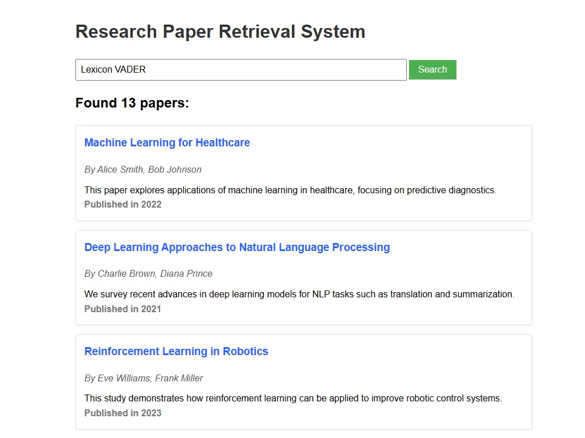

# Research Paper Retrieval System

## Overview
The Research Paper Retrieval System is a multi-agent AI system designed to search and retrieve research papers based on user queries. It utilizes advanced search techniques and models to provide relevant results efficiently.

## Key Features
- **Hybrid Search Technology**: Combines keyword-based (BM25) and semantic similarity (FAISS) search for superior results
- **External API Integration**: Searches ArXiv and Semantic Scholar for up-to-date research papers
- **Web Interface**: Simple and intuitive UI for searching papers
- **Duplicate Detection**: Intelligently removes duplicate papers from different sources
- **Multi-Agent Architecture**: Modular design with specialized agents for different tasks

## Project Structure
```
research-paper-retrieval-system
├── src
│   ├── __init__.py
│   ├── main.py
│   ├── agents
│   │   ├── __init__.py
│   │   ├── base_agent.py
│   │   ├── retrieval_agent.py
│   │   └── query_agent.py
│   ├── utils
│   │   ├── __init__.py
│   │   ├── arxiv_fetcher.py
│   │   ├── semantic_scholar_fetcher.py
│   │   ├── paper_processor.py
│   │   ├── text_embeddings.py
│   │   └── query_parser.py
│   ├── models
│   │   ├── __init__.py
│   │   ├── paper.py
│   │   └── query.py
│   └── config
│       ├── __init__.py
│       └── settings.py
├── tests
│   ├── __init__.py
│   ├── test_retrieval_agent.py
│   └── test_query_agent.py
├── Templates
│   ├── index.html
├── data
│   └── paper_index (HuggingFace Transformers - MiniLM-L6-v2)
├── requirements.txt
├── setup.py
├── .gitignore
└── README.md
```



## Installation
To set up the project, clone the repository and install the required dependencies:

```bash
git clone <repository-url>
cd research-paper-retrieval-system
pip install -r requirements.txt
```

## Usage
To run the application, execute the following command:

```bash
python src/main.py
```

This will start the server, and you can interact with the retrieval system through the defined API endpoints.
This will start the server at http://localhost:8000, and you can access the web interface through your browser.

## Features
- **Retrieval Agent**: Efficiently searches and retrieves research papers using BM25 and FAISS.
- **Query Agent**: Processes user queries and interacts with the Retrieval Agent.
- **Text Embeddings**: Generates embeddings for documents to improve search accuracy.
- **Paper Processing**: Utilities for parsing and formatting research papers.

## Testing
To run the tests, use the following command:

```bash
pytest tests/
```

This will execute the unit tests for both the Retrieval Agent and Query Agent.

## Contributing
Contributions are welcome! Please submit a pull request or open an issue for any enhancements or bug fixes.

## License
This project is licensed under the MIT License. See the LICENSE file for details.